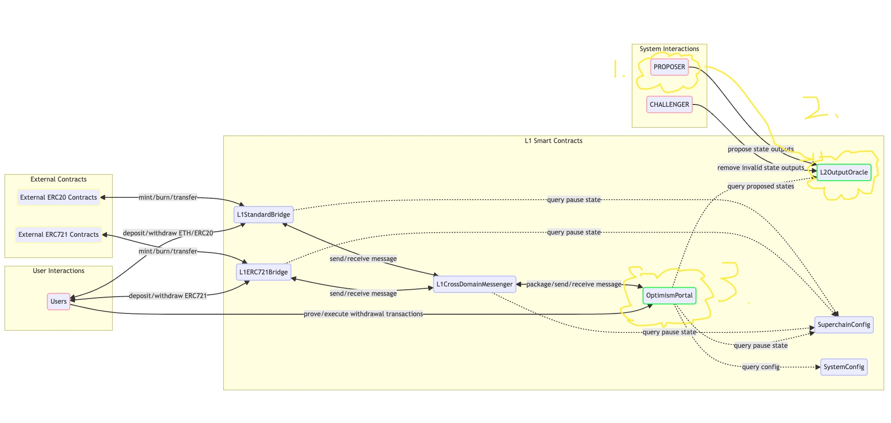

# Chapter 1: What is Fault Proof?

## Section 1: Why Do We Need Fault Proof?

Before delving deeper into what Fault Proof is, let's first consider why it is necessary and what key issues it resolves.

## The Optimism Mechanism Before the Introduction of Fault Proof

Imagine the key steps involved in a withdrawal transaction initiated from L2 and successfully executed on L1:

1. A user initiates a withdrawal transaction 'a' on L2.
2. Transaction 'a' is included in a block.
3. The block is confirmed as finalized.
4. The proposer sends the state outputs of the block to the L2OutputOracle contract on L1.
5. The Portal contract queries the L2OutputOracle contract for the state outputs to verify that the user has indeed initiated a valid withdrawal transaction on L2.
6. The user successfully withdraws the funds.

Key roles include: Proposer, L2OutputOracle, and Portal Contract. Refer to the image below.

Analyzing these roles, which are centrally operated solely by Optimism?

The Proposer and L2OutputOracle work together to ensure the normal transmission of L2's state outputs to L1. Since no one else can participate in this process, if the Proposer acts maliciously or experiences a downtime, the impact is significant. Therefore, we urgently need a highly decentralized solution that allows everyone to participate.

## How Fault Proof Perfectly Solves This Problem

By introducing Fault Proof, anyone can propose and verify the state outputs of a block. It can be said that Fault Proof was introduced to more effectively carry out the necessary validations on L1 to ensure the accurate transmission of L2 state outputs.

# Section 2: What is Fault Proof

The previous section discussed the necessity of Fault Proof. This section will mainly introduce the basic principles and components of Fault Proof.

## Overview of Fault Proof Design

Before delving into the formal mechanisms and roles of Fault Proof, let's first attempt to design a simple Fault Proof model. The requirements are as follows:
1. The state can be queried through the Portal contract on the blockchain.
2. Anyone can participate.
3. Errors in the state can be corrected.

### Preliminary Design

Based on these requirements, we can design a simple on-chain smart contract:

[CODE]

However, there is a problem with this design: the state can be arbitrarily modified. Even though maintainers may correct the state each time, this method still has significant shortcomings. So, how can we improve this? Can we introduce a judge role to make determinations? Unfortunately, if we only introduce a judge, this role would have absolute power similar to the previous Proposer.

Therefore, why not abstract the judge's decision-making logic and implement a similar judicial process on the blockchain?

### Abstracted Approval Logic and Design

When a state dispute occurs, a judge usually intervenes, reruns all transactions on L2 until the final state is recalculated, and compares it with the state proposed by the disputing parties to determine the correct one. We can simulate this process by implementing a smart contract similar to a MIPS virtual machine on the blockchain. When a dispute arises, simply run the MIPS virtual machine on the blockchain to obtain the correct state.

But is this method perfect? The answer is no, as the cost of executing this entire logic on the blockchain is extremely high, potentially exceeding 1000 ETH in gas fees, which is clearly unacceptable.

### Further Optimized Design

Then, how can we ensure on-chain judgment while minimizing costs? Analyzing the root cause of state disputes, we often find that errors occur during the execution of a particular operation, leading to deviations in all subsequent calculations. Therefore, we only need to pinpoint the specific point of error.

Let's consider having the disputing parties verify each other's instructions until a discrepancy is found. However, this method is inefficient. We could try checking every 100 or 1000 instructions, but this is still not efficient enough. In such scenarios, what searching method can quickly identify the differences?

The answer is binary search!

Using binary search, we can quickly locate the root of the disagreement between the parties and integrate this process into an on-chain smart contract.

### Design Feedback

In the steps above, we designed a preliminary Fault Proof model, but there are still many issues to be resolved. Next, we will detail the various components of Fault Proof and in the following chapters, compare our preliminary design with the formal Fault Proof, and discuss the issues the formal version addresses that we have not yet considered.
