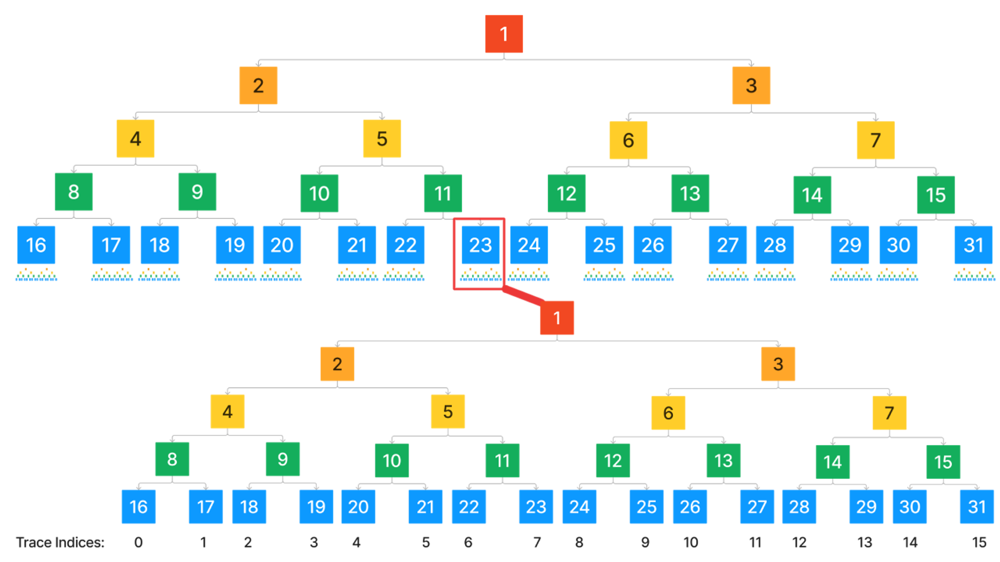
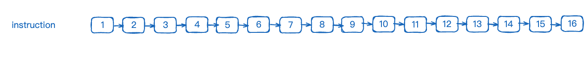
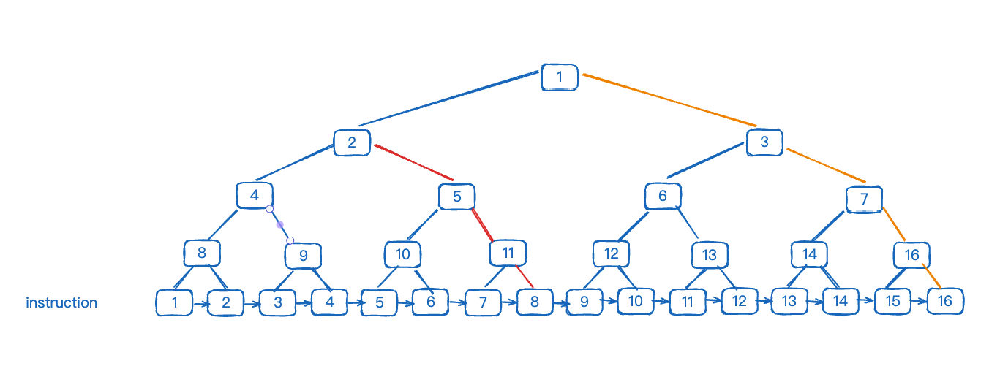
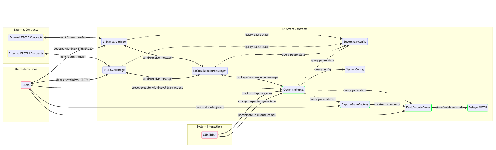
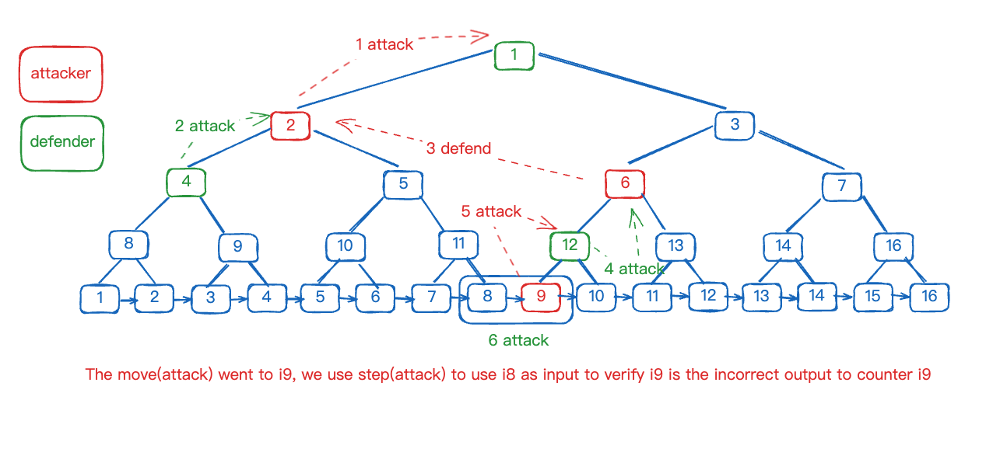
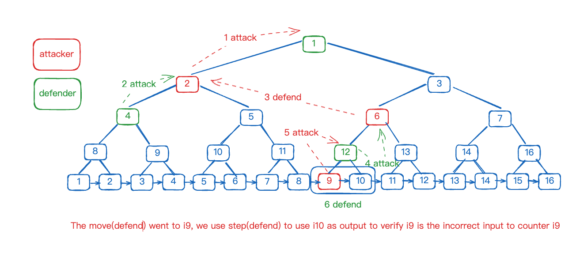

# Fault-Dispute-Game

In this chapter, we will provide a detailed introduction to the Fault-Dispute-Game. We will start from the design philosophy and gradually delve into the code level. Please note, certain aspects such as the CANNON virtual machine will be explained in subsequent chapters.

## Identifying Issues

Let’s revisit the simple fault proof design from the previous chapter, found [here](https://github.com/joohhnnn/The-book-of-optimism-fault-proof/blob/main/01-what-is-fault-proof.md), and discuss its issues. After reading this chapter, you should understand the answers to these issues.

1. How is each Fault-Dispute-Game created? How can these games be better managed?
2. How do we ensure there is no lack of participation? Considering that fault-proof is designed to allow anyone to participate, how can we lower technical barriers to attract third parties or the general public?
3. How can we control the consumption during the entire game process? If each fault proof requires detailed resolution, the necessary gas fees might exceed several hundred ETH, which is unacceptable in non-extreme cases.
4. How can we prevent a situation where one party withdraws, causing the game to be unable to continue?

## Concepts and Role Introduction

In fault proof, there are several concepts that need to be introduced beforehand. We will describe them in a direct and easy-to-understand manner.

### [game-tree](https://github.com/ethereum-optimism/specs/blob/main/specs/fault-proof/stage-one/fault-dispute-game.md#game-tree)

The game-tree is a crucial concept. For example, the root of a game-tree X represents the state of an endpoint batch of L2 blocks, from L2 block N to N+X. If we need to prove that the X state is correct, do we need to start from block N and trace each transaction’s VM operation up to block N+X? This introduces the concepts of 'SPLIT_DEPTH' and 'MAX_GAME_DEPTH'. Simply put, the granularity of the depth at the block layer is 'SPLIT_DEPTH'; anything beyond this layer requires tracing of VM operation instructions. Thus, using a binary search method, the game-tree can be seen as a large binary tree. After 'SPLIT_DEPTH', there are significant changes in business processing, and we logically split the binary tree into two major parts, as shown in the following diagram:



### [Claims](https://github.com/ethereum-optimism/specs/blob/main/specs/fault-proof/stage-one/fault-dispute-game.md#claims)

Claims can be understood as the state hash representing the result of executing a specific instruction within an L2 transaction. The state refers to the configuration of the MIPS virtual machine, including memory layout, register distribution, etc.

As illustrated, it represents the execution flow of the first 16 instructions of a transaction, each execution generating a state hash, known as a Claim.

Note: The Root Claim is special. The Root Claim is consistent with the old Output Hash, which is composed of the stateRoot, messagePasserStorageRoot, and latestBlockhash.

Here, we introduce the concept of `trace index`.

**trace index**: It breaks down all L2 blocks and splits all transactions into instructions, arranged in order of execution.

As shown, the sequence number at the bottom of the binary tree is the `trace index`, such as for nodes 1, 3, 7, and 16 all having a trace index of 16. What is the function of the `trace index`? From node 1 on the orange route, the `trace index` is 16, while for node 2 on the red route, it is 8. Thus, it is clear why node 1 at the start of the orange route can serve as the state root for the entire GAME because it points to the state root behind the last instruction, the ultimate state root.

Also, this reveals the essence of binary division; when a dispute arises, it signifies our first division, where the `trace index` of node 2 is exactly the midpoint.

### [Fault Proof VM](https://github.com/ethereum-optimism/specs/blob/main/specs/fault-proof/index.md#fault-proof-vm)

Our on-chain implemented instruction virtual machine, such as CANNON (MIPS virtual machine).

### [DisputeGameFactory](https://etherscan.io/address/0xe5965Ab5962eDc7477C8520243A95517CD252fA9)

DisputeGameFactory is the entry point for creating various types of dispute games. It can be called by anyone and is responsible for tracking and managing effective Game data.

### [DelayedWETH](https://github.com/ethereum-optimism/specs/blob/dfa8ea9568b0e35827be763fa8e6a2eeb9d90704/specs/fault-proof/stage-one/bond-incentives.md#delayedweth)

DelayedWETH is a modified version of WETH, mainly used for incentives and rewards distribution in dispute games. Its existence makes the entire incentive system more secure.

### [Game Clock](https://github.com/ethereum-optimism/specs/blob/dfa8ea9568b0e35827be763fa8e6a2eeb9d90704/specs/fault-proof/stage-one/fault-dispute-game.md#game-clock)

The Game Clock is similar to the concept of a chess clock, where each side has their own countdown timer. Once an action is completed and the timer is pressed, the opponent's timer begins to count down. If a winner is not determined before the timer ends, the side whose timer runs out first will be deemed the loser.

### [ANCHOR_STATE_REGISTRY](https://etherscan.io/address/0x18DAc71c228D1C32c99489B7323d441E1175e443)

The ANCHOR_STATE_REGISTRY is a contract used to store and manage state data that has been verified through fault proof.

### [Moves](https://github.com/ethereum-optimism/specs/blob/dfa8ea9568b0e35827be763fa8e6a2eeb9d90704/specs/fault-proof/stage-one/honest-challenger-fdg.md#moves)

Moves are divided into Attack and Defend, but we should not get too hung up on these newly created concepts. We can still understand them from the perspective of binary division. In traditional binary division, the participant is usually alone, and the criteria for judgment are fixed. However, in the Fault Dispute Game (FDG), there may be two standards of judgment due to differences in perspectives between the two sides. Typically, we discuss binary division from the perspective of "us," describing the process as "narrowing the range through binary division," which can be subdivided into two steps: 1. Finding the midpoint; 2. Choosing the appropriate part. In the FDG environment, if a challenge occurs, indicating that the two sides have differing views on the issue, especially in the second step, the two sides may make different choices. For example, an "attack" operation can be seen as choosing to continue with the left half, while a "defend" operation is equivalent to choosing the right half.

For instance, consider five numbers: 1, 2, 3, 4, 5. Under normal circumstances, there should be no issues with how these numbers are handled. But if challenger A believes there is a problem with the number 4, and therefore launches an attack, marked as attack 1, this attack will split the data at number 3 into two parts: 123 and 345. At this point, defender B may not understand why A initiated the attack and might mistakenly think that A believes there is an error in 123, so he simply chooses to counter A's attack 1, which we call attack 2, believing the 123 part is correct. However, in reality, B's intention is due to the issue with number 4, so he maintains his attack 1, shifting the focus to the 345 part.

### [Step](https://github.com/ethereum-optimism/specs/blob/dfa8ea9568b0e35827be763fa8e6a2eeb9d90704/specs/fault-proof/stage-one/honest-challenger-fdg.md#steps)

The operation after Moves reach 'MAX_GAME_DEPTH', which requires verification in the 'Fault Proof VM'.

### [Resolve](https://github.com/ethereum-optimism/specs/blob/dfa8ea9568b0e35827be763fa8e6a2eeb9d90704/specs/fault-proof/stage-one/honest-challenger-fdg.md#resolution)

Divided into ResolveClaim and Resolve, when one side is successfully proven in Step, or the Game Clock timer ends, the game is resolved through ResolveClaim and Resolve to reveal the winner and further distribute incentive bonuses.

## Post-Fault-Proof Smart Contract Architecture



In this diagram, we can clearly see the previous proposer architecture replaced by the FaultDisputeGame architecture (highlighted in green). Let’s delve into the specific details of these main components!

## Workflow

Let's outline an actual process to understand the entire workflow:

1. User A creates GAME A through 'DisputeGameFactory', deposits bond funds as collateral, and claims Claim B.

    1.1 If User A's Claim B is correct:
    
    1.1.1 If there are no malicious challenges and the challenge period (chess clock) ends, the Claim is marked as valid by Resolve.
    
    1.1.2 If User B challenges, User A counters, and both parties compete until the finest granularity, and a judgment is made through the step. First, the op-program needs to be simulated locally, then relevant data uploaded to the pre-image-oracle, and finally, the step triggers the on-chain FPVM-cannon to determine the real outcome. Both parties consume a significant amount of ETH as gas and collateral, but since A is objectively correct, he will take all of B’s collateral after winning, which more than compensates for A’s gas expenses and results in a substantial income. Alternatively, B realizes his mistake in time, ceases further attacks, and waits for the chess clock to end, resulting in A being declared the winner.

    1.2 If User A's Claim B is incorrect: the process is the same as 1.1.2.

## Understanding the Code

### Creating a Game through DisputeGameFactory

[Full code link](https://github.com/ethereum-optimism/optimism/blob/d091bb33ceba0931205584d88b8c2bd84404e466/packages/contracts-bedrock/src/dispute/DisputeGameFactory.sol#L84)

```solidity

    function create(
        GameType _gameType,
        Claim _rootClaim,
        bytes calldata _extraData
    )
        external
        payable
        returns (IDisputeGame proxy_)
    {
        …

        proxy_ = IDisputeGame(address(impl).clone(abi.encodePacked(msg.sender, _rootClaim, parentHash, _extraData)));
        proxy_.initialize{ value: msg.value }();

        // Compute the unique identifier for the dispute game.
        Hash uuid = getGameUUID(_gameType, _rootClaim, _extraData);

        // If a dispute game with the same UUID already exists, revert.
        if (GameId.unwrap(_disputeGames[uuid]) != bytes32(0)) revert GameAlreadyExists(uuid);

        // Pack the game ID.
        GameId id = LibGameId.pack(_gameType, Timestamp.wrap(uint64(block.timestamp)), address(proxy_));

        _disputeGames[uuid] = id;
        _disputeGameList.push(id);
    }
```

First, let's examine what the three input parameters represent:
1. `gameType`: Indicates the type of verification VM being used, with most currently being type 0, Cannon.

    [game type 0](https://sepolia.etherscan.io/address/0x200b7F3259E1c2F5be6d801339d4E8C3d4534f15#code): FaultDisputeGame 
    [game type 1](https://sepolia.etherscan.io/address/0xFDcA34EDa4cf5944E9fa0D5DBE2A515a88650FB7#code): PermissionedDisputeGame

2. `rootClaim`: Represents the rootClaim involved in proving this game, which in the old mechanism was the L2 state root published to L1 by the proposer.

3. `extraData`: In the case of type 0, this data represents the block number on L2.

It is worth noting that the factory uses the concept of minimal proxy contracts, which allows us to see that the actual contract size of the GAME is very small, thereby reducing deployment costs. For those interested, you can check out [EIP-1167](https://eips.ethereum.org/EIPS/eip-1167).

Each specific Claim Game can only be created once and is added to the disputeGameList for unified tracking upon creation.

### Game 
The `FaultDisputeGame.sol` contract is the core component of the Fault-Dispute-Game, primarily implementing three key operations: `move`, `step`, and `resolve`.

#### move()

[Full code link](https://github.com/ethereum-optimism/optimism/blob/78e1084ec14d3003cb9e546b9eb5a22db7408ac2/packages/contracts-bedrock/src/dispute/FaultDisputeGame.sol#L319)

The main operations of the `move()` function include:
1. Calculating the position of the next move based on whether it is an `attack` or `defend`.
2. Verifying the validity of the submitted next claim data, conducting specific checks to ensure the correctness of each move's bond collateral and the clock, and recalculating the remaining chess clock time.
3. Storing the results in claimData and subgame for subsequent operations.

```solidity
    function move(Claim _disputed, uint256 _challengeIndex, Claim _claim, bool _isAttack) public payable virtual {

        ClaimData memory parent = claimData[_challengeIndex];

        //----------part1 start----------
        Position parentPos = parent.position;
        Position nextPosition = parentPos.move(_isAttack);
        uint256 nextPositionDepth = nextPosition.depth();
        //----------part1 end----------
        
        //----------part2 start----------
        if (getRequiredBond(nextPosition) != msg.value) revert IncorrectBondAmount();

        if (nextDuration.raw() == MAX_CLOCK_DURATION.raw()) revert ClockTimeExceeded();

        if (nextDuration.raw() > MAX_CLOCK_DURATION.raw() - CLOCK_EXTENSION.raw()) {

        Clock nextClock = LibClock.wrap(nextDuration, Timestamp.wrap(uint64(block.timestamp)));
        //----------part2 end----------

        //----------part3 start----------
        claimData.push(
            ClaimData({
                parentIndex: uint32(_challengeIndex),
                // This is updated during subgame resolution
                counteredBy: address(0),
                claimant: msg.sender,
                bond: uint128(msg.value),
                claim: _claim,
                position: nextPosition,
                clock: nextClock
            })
        );

        // Update the subgame rooted at the parent claim.
        subgames[_challengeIndex].push(claimData.length - 1);

        // Deposit the bond.
        WETH.deposit{ value: msg.value }();
        //----------part3 end----------

    }
```

---

#### step()
The `step()` function is called when `move()` reaches `MAX_GAME_DEPTH`, necessitating the intervention of an on-chain VM like **cannon**.

This process is a crucial step for both parties to reach a consensus, with `step` being the final phase in this consensus process.

**attack**: The attacker provides the previous node of the node being refuted as input, derives the result forward, and compares it to the refuted node to verify its incorrectness.



In attack, there is only one scenario: both parties reach a consensus at instruction 8 (*Note: 'I' will replace 'instruction' throughout this document*), and a disagreement arises about the validity of I 9, beginning from I 8 to verify whether I 9 is valid. Simply put, "You have provided a piece of evidence, I derived a result from this evidence that contradicts your claim, and we will verify this process. If your evidence cannot lead to your claim, then your claim is invalid."

**defend**: The defender provides output, uses reverse deduction to use the refuted target as input to verify that the refuted target is incorrect.



Defense involves verifying whether I 10 on the right side of refuted I 9 is valid for a rebuttal. There are two scenarios:
1. The claim data of I 10 comes from the opponent of the one who proposed I 9, meaning I 9 and I 10 hold opposite opinions, and it is necessary to verify that I 10 as an output is valid.
2. The claim data of I 10 comes from the proposer of I 9, meaning I 9 and I 10 hold the same opinions, and it is necessary to prove that I 10 is invalid.

Execution process:
- For an attack, execute with data source I 8 in the VM, compare the result with I 9, and complete the rebuttal.
- For a defend, verify whether I 10 on the right side of refuted I 9 is valid for a rebuttal. This may involve verifying the source of I 10's claim data to confirm its validity or derive content to rebut I 9, thus completing the rebuttal process.

##### code:
[Full code link](https://github.com/ethereum-optimism/optimism/blob/78e1084ec14d3003cb9e546b9eb5a22db7408ac2/packages/contracts-bedrock/src/dispute/FaultDisputeGame.sol#L234)

Key operations include:
1. Determine whether the operation is an attack or defend, find the corresponding data from the DAG based on the trace index, and initialize the prestate and poststate.
2. Execute in the VM to determine validity, and in the case of defend, determine which scenario it belongs to.
3. If the rebuttal is successful, record the data.

```solidity
function step(
    uint256 _claimIndex,
    bool _isAttack,
    bytes calldata _stateData,
    bytes calldata _proof
)
    public
    virtual
{

    ClaimData storage parent = claimData[_claimIndex];

    Position parentPos = parent.position;
    Position stepPos = parentPos.move(_isAttack);

    // Determine the expected pre & post states of the step.
    Claim preStateClaim;
    ClaimData storage postState;
    
    //----------part1 start----------
    if (_isAttack) {
        preStateClaim = (stepPos.indexAtDepth() % (1 << (MAX_GAME_DEPTH - SPLIT_DEPTH))) == 0
            ? ABSOLUTE_PRESTATE
            : _findTraceAncestor(Position.wrap(parentPos.raw() - 1), parent.parentIndex, false).claim;
        postState = parent;
    } else {
        preStateClaim = parent.claim;
        postState = _findTraceAncestor(Position.wrap(parentPos.raw() + 1), parent.parentIndex, false);
    }
    //----------part1 end----------
    
    if (keccak256(_stateData) << 8 != preStateClaim.raw() << 8) revert InvalidPrestate();

    // Compute the local preimage context for the step.
    Hash uuid = _findLocalContext(_claimIndex);
    //----------part2 start----------
    bool validStep = VM.step(_stateData, _proof, uuid.raw()) == postState.claim.raw();
    bool parentPostAgree = (parentPos.depth() - postState.position.depth()) % 2 == 0;
    //----------part2 end----------
    
    //----------part3 start----------
    if (parentPostAgree == validStep) revert ValidStep();

    parent.counteredBy = msg.sender;
    //----------part3 end----------
}
```  

#### resolveClaim() & resolve()

[Full code link for resolveClaim()](https://github.com/ethereum-optimism/optimism/blob/78e1084ec14d3003cb9e546b9eb5a22db7408ac2/packages/contracts-bedrock/src/dispute/FaultDisputeGame.sol#L560): resolveClaim is responsible for finalizing all subgames under a claim and concluding the entire claim.
[Full code link for resolve()](https://github.com/ethereum-optimism/optimism/blob/78e1084ec14d3003cb9e546b9eb5a22db7408ac2/packages/contracts-bedrock/src/dispute/FaultDisputeGame.sol#L541): resolve finalizes the entire game after all subgames have ended.

---

The operations of resolveClaim are divided into two scenarios:

- Handling subgames, with `_numToResolve` as 0.
    1. Check if the chess clock has already run out.
    ```solidity
        if (challengeClockDuration.raw() < MAX_CLOCK_DURATION.raw()) revert ClockNotExpired();
    ```
    2. Determine if it is the finest granularity subgame. If it is, credit the paid bond to the account of the successful rebuttal, mark the subgame as resolved, and return.
    ```solidity
        if (challengeIndicesLen == 0 && _claimIndex != 0) {
            address counteredBy = subgameRootClaim.counteredBy;
            address recipient = counteredBy == address(0) ? subgameRootClaim.claimant : counteredBy;
            _distributeBond(recipient, subgameRootClaim);
            resolvedSubgames[_claimIndex] = true;
            return;
        }
    ```

- Handling the main claim, where `_numToResolve` is the number of subgames to be verified in a single transaction. The sum of subgames processed in each operation must equal the total number of subgames.
    1. Check if the chess clock has already run out.
    ```solidity
        if (challengeClockDuration.raw() < MAX_CLOCK_DURATION.raw()) revert ClockNotExpired();
    ```
    2. Determine if this is the first time the current claim is being executed with resolveClaim. If so, create and initialize a checkpoint to handle the case of multiple transactions completing resolveClaim together.
    ```solidity
        // If the checkpoint does not currently exist, initialize the current left most position as max u128.
        if (!checkpoint.initialCheckpointComplete) {
            checkpoint.leftmostPosition = Position.wrap(type(uint128).max);
            checkpoint.initialCheckpointComplete = true;

            if (_numToResolve == 0) _numToResolve = challengeIndicesLen;
        }
    ```
    3. Loop to verify if all subtasks are resolved, ensuring during the loop to secure the [leftmost claim incentives](https://github.com/ethereum-optimism/specs/blob/dfa8ea9568b0e35827be763fa8e6a2eeb9d90704/specs/fault-proof/stage-one/bond-incentives.md#leftmost-claim-incentives).
    ```solidity
        uint256 lastToResolve = checkpoint.subgameIndex + _numToResolve;
        uint256 finalCursor = lastToResolve > challengeIndicesLen ? challengeIndicesLen : lastToResolve;
        for (uint256 i = checkpoint.subgameIndex; i < finalCursor; i++) {
            uint256 challengeIndex = challengeIndices[i];

            // INVARIANT: Cannot resolve a subgame containing an unresolved claim
            if (!resolvedSubgames[challengeIndex]) revert OutOfOrderResolution();

            ClaimData storage claim = claimData[challengeIndex];

            // If the child subgame is uncountered and further left than the current left-most counter,
            // update the parent subgame's `countered` address and the current `leftmostCounter`.
            // The left-most correct counter is preferred in bond payouts in order to discourage attackers
            // from countering invalid subgame roots via an invalid defense position. As such positions
            // cannot be correctly countered.
            // Note that correctly positioned defense, but invalid claimes can still be successfully countered.
            if (claim.counteredBy == address(0) && checkpoint.leftmostPosition.raw() > claim.position.raw()) {
                checkpoint.counteredBy = claim.claimant;
                checkpoint.leftmostPosition = claim.position;
            }
        }
    ```
    4. If there are no unresolved subgames for the claim, determine the rebuttal based on the current claim's rebuttal status and distribute the bond rewards.
    ```solidity
        // Increase the checkpoint's cursor position by the number of children that were checked.
        checkpoint.subgameIndex = uint32(finalCursor);

        // Persist the checkpoint and allow for continuing in a separate transaction, if resolution is not already
        // complete.
        resolutionCheckpoints[_claimIndex] = checkpoint;

        // If all children have been traversed in the above loop, the subgame may be resolved. Otherwise, persist the
        // checkpoint and allow for continuation in a separate transaction.
        if (checkpoint.subgameIndex == challengeIndicesLen) {
            address countered = checkpoint.counteredBy;

            // Mark the subgame as resolved.
            resolvedSubgames[_claimIndex] = true;

            // Distribute the bond to the appropriate party.
            if (_claimIndex == 0 && l2BlockNumberChallenged) {
                // Special case: If the root claim has been challenged with the `challengeRootL2Block` function,
                // the bond is always paid out to the issuer of that challenge.
                address challenger = l2BlockNumberChallenger;
                _distributeBond(challenger, subgameRootClaim);
                subgameRootClaim.counteredBy = challenger;
            } else {
                // If the parent was not successfully countered, pay out the parent's bond to the claimant.
                // If the parent was successfully countered, pay out the parent's bond to the challenger.
                _distributeBond(countered == address(0) ? subgameRootClaim.claimant : countered, subgameRootClaim);

                // Once a subgame is resolved, we percolate the result up the DAG so subsequent calls to
                // resolveClaim will not need to traverse this subgame.
                subgameRootClaim.counteredBy = countered;
            }
        }
    ```

resolve:
1. Verify the resolution status and update the global state.
2. Update the latest L2 block number and root hash in the ANCHOR_STATE_REGISTRY.

```solidity
    function resolve() external returns (GameStatus status_) {
        // INVARIANT: Resolution cannot occur unless the game is currently in progress.
        if (status != GameStatus.IN_PROGRESS) revert GameNotInProgress();

        // INVARIANT: Resolution cannot occur unless the absolute root subgame has been resolved.
        if (!resolvedSubgames[0]) revert OutOfOrderResolution();

        // Update the global game status; The dispute has concluded.
        status_ = claimData[0].counteredBy == address(0) ? GameStatus.DEFENDER_WINS : GameStatus.CHALLENGER_WINS;
        resolvedAt = Timestamp.wrap(uint64(block.timestamp));

        // Update the status and emit the resolved event, note that we're performing an assignment here.
        emit Resolved(status = status_);

        // Try to update the anchor state, this should not revert.
        ANCHOR_STATE_REGISTRY.tryUpdateAnchorState();
    }
```

## Conclusion

The content above covers the core aspects of the entire Fault Dispute Game on-chain contract. In this chapter, we have detailed the main operations within the contract such as move, step, and resolve, and delved deeply into the implementation logic through specific code segments.

It is noteworthy that we have not yet discussed the on-chain virtual machine (MIPS) in detail. The specifics and working principles of the on-chain VM will be explored in the next chapter, where we will further understand its specific applications and importance in the Fault Dispute Game.
