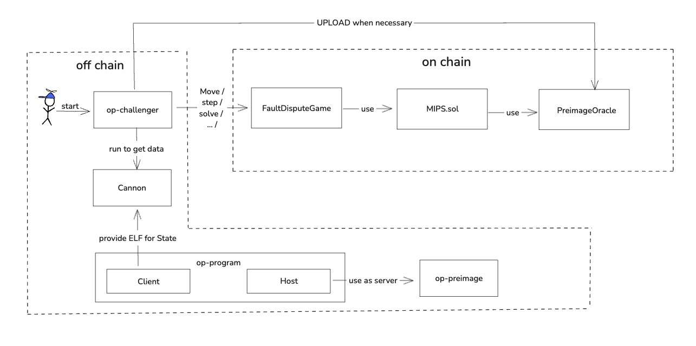

# CANNON
CANNON is a core component within the entire fault-proof architecture. This chapter will provide a detailed introduction to CANNON.

## Component Relationships
Before delving deeply into CANNON, it's important to understand a key concept: CANNON does not operate independently. CANNON works in coordination with OP-Challenger, OP-Program, and OP-Preimage.

OP-Challenger is responsible for overall control, monitoring blockchain data, and executing various operations such as creating games, and executing move, step, and resolve actions.

CANNON comprises two parts: one part is MIPS.sol on the blockchain, a MIPS instruction processor written in Solidity, primarily responsible for validating the finest granularity of execution. The other part is mipsevm off-chain, implemented in Go, mainly for generating the witness data needed on-chain, which can be understood as input parameters for the step function. The on-chain and off-chain components are equivalent, meaning given the same inputs, they produce the same outputs.

OP-Program also consists of two parts: one is the client, responsible for converting itself into an ELF file and loading it into CANNON for use. The other is the host, responsible for configuring and starting the OP-Preimage service to provide necessary additional data for mipsevm when in use.

OP-Preimage handles the actual preimage logic.

Their relationships are illustrated in the following diagram:


### OP-Challenger Interaction with Cannon
When OP-Challenger needs to generate proof to execute the step operation on the blockchain, it runs CANNON to obtain the necessary state, proof, or additional preimage information.

### Cannon Interaction with OP-Program
1. The client part of OP-Program provides CANNON with the ELF instruction set file, which is used to operate CANNON.
2. The host part of OP-Program provides additional data for CANNON, such as block numbers and other non-native instruction data.

### OP-Program Interaction with OP-Preimage
The host part of OP-Program initializes and configures to start the OP-Preimage, providing the necessary additional data for CANNON.

## MIPS
Here, we do not need to delve deeply into what MIPS itself is, but rather consider why such a middle medium is necessary. In our previous design of FDG, it involved executing the finest granularity instructions on the blockchain for verification. Simply put, this involves implementing an L2 backend execution client in the L1 EVM environment using Solidity. It is impossible to fully restore the entire system in Solidity, and even with maximum effort, due to complexity, it is difficult to ensure that the same outputs are produced on-chain and off-chain given the same inputs. Therefore, we need an intermediate state VM to ensure that the results run off-chain and on-chain are consistent, and MIPS serves this purpose. Off-chain, it does not directly run a Go program but runs a MIPS program represented by an ELF file derived from a Go program. On-chain, it also implements the MIPS instruction set, maintaining equivalence between the two.

MIPS is a simple instruction set operating system, making its implementation in Solidity feasible.

MIPS mainly includes two types of instructions:
1. Regular instructions, used for routine program computations and controls, such as arithmetic operations, data loading, and conditional branches.
2. System instructions, syscall, used for performing system calls, i.e., requesting services from the operating system, such as reading files, creating processes, etc. Specifically, read operations require cooperation with the Pre-image contract, such as reading block headers, MPT nodes, receipts, transactions, blobs, and other data.

Two key types of data structures include:
1. State

```solidity
    struct State {
        bytes32 memRoot;
        bytes32 preimageKey;
        uint32 preimageOffset;
        uint32 pc;
        uint32 nextPC;
        uint32 lo;
        uint32 hi;
        uint32 heap;
        uint8 exitCode;
        bool exited;
        uint64 step;
        uint32[32] registers;
    }
```

The on-chain MIPS is purely a logical function and does not contain any state; all state information is passed in during calls. The State type mainly includes memory information, instruction details, and register data.

2. ProofData

ProofData consists of tightly packed [Merkle tree proof data](https://medium.com/crypto-0-nite/merkle-proofs-explained-6dd429623dc5), used to validate the authenticity of state data.

For those interested in the full details of MIPS, you can refer [here](https://docs.optimism.io/stack/protocol/fault-proofs/mips#further-reading).

## pre-image-oracle

If the execution of a transaction is broken down into a series of instructions, most are basic instructions, and a small portion are system instructions, among which only about 0.1% are system instructions that require reading operations. Thus, when designing the STEP() function, it is necessary to treat these two scenarios separately: the context needed for basic instructions is directly passed in through the input parameters at the time of the call. For system instructions that require reading special information, considering their low probability of occurrence, they do not occupy input parameters. Instead, a separate Pre-image-oracle component is designed to pass the relevant data, serving as a communication intermediary in the fault-proof process.

## CANNON on the Blockchain

The on-chain entity of CANNON is the MIPS.sol file, with the main part being the [step() function](https://github.com/ethereum-optimism/optimism/blob/develop/packages/contracts-bedrock/src/cannon/MIPS.sol#L204), which is directly called by the step() function from our previous chapter on FDG.

Here is a complete breakdown of the `step()` function, divided into the following parts:

1. Data verification: Before unpacking the data, checks are made for memory offsets and structural integrity.
2. Defining helper functions: To tightly pack state data in memory for later use.
3. Retrieving instruction content: Obtaining specific instruction content through the pc in the state, using Merkle trees in the process to verify the relationships between state data to ensure accuracy.
4. System instruction call: If it's a syscall (system instruction call), jump to the corresponding logic for execution and return the result. If it's a read operation, additional interaction with the Pre-image-oracle is required.
5. Basic instruction execution: Execute the basic instructions, update the relevant variables, and return the results.

For the above steps 3, 4, and 5, further explanations are not provided here, but if you are interested in these parts, you can directly access the related code for in-depth reading through the following links:
- Step 3: [Detailed code](https://github.com/ethereum-optimism/optimism/blob/5e317379fae65b76f5a6ee27581f0e62d2fe017a/packages/contracts-bedrock/src/cannon/libraries/MIPSInstructions.sol#L14)
- Step 4: [Detailed code](https://github.com/ethereum-optimism/optimism/blob/5e317379fae65b76f5a6ee27581f0e62d2fe017a/packages/contracts-bedrock/src/cannon/MIPS.sol#L134)
- Step 5: [Detailed code](https://github.com/ethereum-optimism/optimism/blob/5e317379fae65b76f5a6ee27581f0e62d2fe017a/packages/contracts-bedrock/src/cannon/libraries/MIPSInstructions.sol#L41)


```solidity
   function step(bytes calldata _stateData, bytes calldata _proof, bytes32 _localContext) public returns (bytes32) {
        unchecked {
            State memory state;
            //-------------------- Part 1 start --------------------
            // Packed calldata is ~6 times smaller than state size
            assembly {
                if iszero(eq(state, 0x80)) {
                    // expected state mem offset check
                    revert(0, 0)
                }
                if iszero(eq(mload(0x40), shl(5, 48))) {
                    // expected memory check
                    revert(0, 0)
                }
                if iszero(eq(_stateData.offset, 132)) {
                    // 32*4+4=132 expected state data offset
                    revert(0, 0)
                }
                if iszero(eq(_proof.offset, STEP_PROOF_OFFSET)) {
                    // 132+32+256=420 expected proof offset
                    revert(0, 0)
                }
            //-------------------- Part 1 end ----------------------
            
            //-------------------- Part 2 start --------------------
                function putField(callOffset, memOffset, size) -> callOffsetOut, memOffsetOut {
                    // calldata is packed, thus starting left-aligned, shift-right to pad and right-align
                    let w := shr(shl(3, sub(32, size)), calldataload(callOffset))
                    mstore(memOffset, w)
                    callOffsetOut := add(callOffset, size)
                    memOffsetOut := add(memOffset, 32)
                }

                // Unpack state from calldata into memory
                let c := _stateData.offset // calldata offset
                let m := 0x80 // mem offset
                c, m := putField(c, m, 32) // memRoot
                c, m := putField(c, m, 32) // preimageKey
                c, m := putField(c, m, 4) // preimageOffset
                c, m := putField(c, m, 4) // pc
                c, m := putField(c, m, 4) // nextPC
                c, m := putField(c, m, 4) // lo
                c, m := putField(c, m, 4) // hi
                c, m := putField(c, m, 4) // heap
                c, m := putField(c, m, 1) // exitCode
                c, m := putField(c, m, 1) // exited
                c, m := putField(c, m, 8) // step

                // Unpack register calldata into memory
                mstore(m, add(m, 32)) // offset to registers
                m := add(m, 32)
                for { let i := 0 } lt(i, 32) { i := add(i, 1) } { c, m := putField(c, m, 4) }
            }
            //-------------------- Part 2 end ----------------------
            
            // Don't change state once exited
            if (state.exited) {
                return outputState();
            }

            state.step += 1;
            
            //-------------------- Part 3 start --------------------
            // instruction fetch
            uint256 insnProofOffset = MIPSMemory.memoryProofOffset(STEP_PROOF_OFFSET, 0);
            (uint32 insn, uint32 opcode, uint32 fun) =
                ins.getInstructionDetails(state.pc, state.memRoot, insnProofOffset);
            //-------------------- Part 3 end ----------------------

            //-------------------- Part 4 start --------------------
            // Handle syscall separately
            // syscall (can read and write)
            if (opcode == 0 && fun == 0xC) {
                return handleSyscall(_localContext);
            }
            //-------------------- Part 4 end ----------------------
            
            //-------------------- Part 5 start --------------------

            // Exec the rest of the step logic
            st.CpuScalars memory cpu = getCpuScalars(state);
            (state.memRoot) = ins.execMipsCoreStepLogic({
                _cpu: cpu,
                _registers: state.registers,
                _memRoot: state.memRoot,
                _memProofOffset: MIPSMemory.memoryProofOffset(STEP_PROOF_OFFSET, 1),
                _insn: insn,
                _opcode: opcode,
                _fun: fun
            });
            setStateCpuScalars(state, cpu);

            return outputState();
            //-------------------- Part 5 end ----------------------
        }
    }
```

## CANNON Off-Chain Implementation

CANNON off-chain is primarily represented in the [Cannon](https://github.com/ethereum-optimism/optimism/tree/develop/cannon) component, which can be used to generate individual execution processes for instructions, or to execute continuously and produce output during the execution process.

### Main Content

Execute and provide input parameters for the move/step actions in the game.

#### Execution
When we execute `cannon run -h`, we can see the flags that need to be passed at runtime. Through these flags, we can gain a deeper understanding of the mechanism of Cannon's off-chain execution.

```shell
./bin/cannon run -h
NAME:
   cannon run - Run VM step(s) and generate proof data to replicate onchain.

USAGE:
   cannon run [command options] [arguments...]

DESCRIPTION:
   Run VM step(s) and generate proof data to replicate onchain. See flags to match when to output a proof, a snapshot, or to stop early.

OPTIONS:
   --type value                          VM type to run. Options are 'cannon' (default) (default: "cannon")
   --input value                         path of input JSON state. Stdin if left empty. (default: "state.json")
   --output value                        path of output JSON state. Not written if empty, use - to write to Stdout. (default: "out.json")
   --proof-at value                      step pattern to output proof at: 'never' (default), 'always', '=123' at exactly step 123, '%123' for every 123 steps
   --proof-fmt value                     format for proof data output file names. Proof data is written to stdout if -. (default: "proof-%d.json")
   --snapshot-at value                   step pattern to output snapshots at: 'never' (default), 'always', '=123' at exactly step 123, '%123' for every 123 steps
   --snapshot-fmt value                  format for snapshot output file names. (default: "state-%d.json")
   --stop-at value                       step pattern to stop at: 'never' (default), 'always', '=123' at exactly step 123, '%123' for every 123 steps
   --stop-at-preimage value              stop at the first preimage request matching this key
   --stop-at-preimage-type value         stop at the first preimage request matching this type
   --stop-at-preimage-larger-than value  stop at the first step that requests a preimage larger than the specified size (in bytes)
   --meta value                          path to metadata file for symbol lookup for enhanced debugging info during execution. (default: "meta.json")
   --info-at value                       step pattern to print info at: 'never' (default), 'always', '=123' at exactly step 123, '%123' for every 123 steps (default: %100000)
   --pprof.cpu                           enable pprof cpu profiling (default: false)
   --debug                               enable debug mode, which includes stack traces and other debug info in the output. Requires --meta. (default: false)
   --debug-info value                    path to write debug info to
   --help, -h                            show help
```

Here are some of the core flags:
- `type`: Specifies the type of VM, currently only supports cannon, but will support more types of virtual machines in the future.
- `input`: Refers to the path of the State type JSON format file, loaded from an ELF file, which can be understood as the environment of the client code at runtime, such as the distribution of memory, status of registers, etc.
- `output`: The path for the output of the latest state after executing based on the input.
- `proof-at`: Outputs the proof after running to position x.
- `snapshot-at`: Outputs the state after running to position x.
- `stop-at`: Terminates after the x-th step.

The command for Cannon is actually not designed for manual single executions but is designed for use with op-challenger. Let's look at how it is used in op-challenger.

```golang
func (e *Executor) GenerateProof(ctx context.Context, dir string, i uint64) error {
	snapshotDir := filepath.Join(dir, snapsDir)
	start, err := e.selectSnapshot(e.logger, snapshotDir, e.absolutePreState, i)
	if err != nil {
		return fmt.Errorf("find starting snapshot: %w", err)
	}
	proofDir := filepath.Join(dir, proofsDir)
	dataDir := filepath.Join(dir, preimagesDir)
	lastGeneratedState := filepath.Join(dir, finalState)
	args := []string{
		"run",
		"--input", start,
		"--output", lastGeneratedState,
		"--meta", "",
		"--info-at", "%" + strconv.FormatUint(uint64(e.infoFreq), 10),
		"--proof-at", "=" + strconv.FormatUint(i, 10),
		"--proof-fmt", filepath.Join(proofDir, "%d.json.gz"),
		"--snapshot-at", "%" + strconv.FormatUint(uint64(e.snapshotFreq), 10),
		"--snapshot-fmt", filepath.Join(snapshotDir, "%d.json.gz"),
	}
	if i < math.MaxUint64 {
		args = append(args, "--stop-at", "="+strconv.FormatUint(i+1, 10))
	}
```

It is evident that it is used under the GenerateProof function, which is primarily utilized by the move (attack & defend) and step actions, meaning that Cannon is called before every move and step. We continue to see how it passes values to the flags: the start comes from the i-th step, and Cannon runs until it reaches i+1, thus the execution of Cannon only progresses by one step.

Therefore, we need to correct a common misconception: the Cannon off-chain virtual machine does not run continuously but operates in the aforementioned manner to retrieve data from a specific position.

#### Specific Implementation
The core component of the Cannon execution off-chain lies in the [Step()](https://github.com/ethereum-optimism/optimism/blob/develop/cannon/mipsevm/singlethreaded/instrumented.go#L66) function and the [mipsStep()](https://github.com/ethereum-optimism/optimism/blob/develop/cannon/mipsevm/singlethreaded/mips.go#L50) function within Cannon.

As can be seen, the step logic in the off-chain Go code aligns closely with the on-chain Solidity step logic. Initially, it loads the memory and other states into a fixed position, then processes further in mipsStep(), such as determining if it's a syscall, among other operations.

```golang
func (m *InstrumentedState) Step(proof bool) (wit *mipsevm.StepWitness, err error) {
	m.preimageOracle.Reset()
	m.memoryTracker.Reset(proof)

	if proof {
		insnProof := m.state.Memory.MerkleProof(m.state.Cpu.PC)
		encodedWitness, stateHash := m.state.EncodeWitness()
		wit = &mipsevm.StepWitness{
			State:     encodedWitness,
			StateHash: stateHash,
			ProofData: insnProof[:],
		}
	}
	err = m.mipsStep()
	if err != nil {
		return nil, err
	}

	if proof {
		memProof := m.memoryTracker.MemProof()
		wit.ProofData = append(wit.ProofData, memProof[:]...)
		lastPreimageKey, lastPreimage, lastPreimageOffset := m.preimageOracle.LastPreimage()
		if lastPreimageOffset != ^uint32(0) {
			wit.PreimageOffset = lastPreimageOffset
			wit.PreimageKey = lastPreimageKey
			wit.PreimageValue = lastPreimage
		}
	}
	return
}
```
```golang
func (m *InstrumentedState) mipsStep() error {
	if m.state.Exited {
		return nil
	}
	m.state.Step += 1
	// instruction fetch
	insn, opcode, fun := exec.GetInstructionDetails(m.state.Cpu.PC, m.state.Memory)

	// Handle syscall separately
	// syscall (can read and write)
	if opcode == 0 && fun == 0xC {
		return m.handleSyscall()
	}

	// Exec the rest of the step logic
	return exec.ExecMipsCoreStepLogic(&m.state.Cpu, &m.state.Registers, m.state.Memory, insn, opcode, fun, m.memoryTracker, m.stackTracker)
}
```

## Conclusion

Through the detailed explanations provided, we have learned that the on-chain component is primarily used for the finest granularity verification in the Fault Proof Game, while the off-chain component is aimed at gradually deriving the corresponding finest granularity position data for on-chain execution. If observed closely, one can see that their architectural patterns are essentially the same, yet there are subtle differences. The on-chain MIPS system is mainly used for verification, thus it focuses only on the results; whereas the off-chain MIPS system places more emphasis on generating usable data, being more user-friendly in terms of data output and storage.

By this design, CANNON not only ensures consistency between on-chain and off-chain data but also optimizes the data processing and verification processes, making the entire system's operation more efficient and reliable. This dual-layer verification mechanism provides solid technical support for the Fault Proof Game, ensuring the fairness and transparency of the game.
