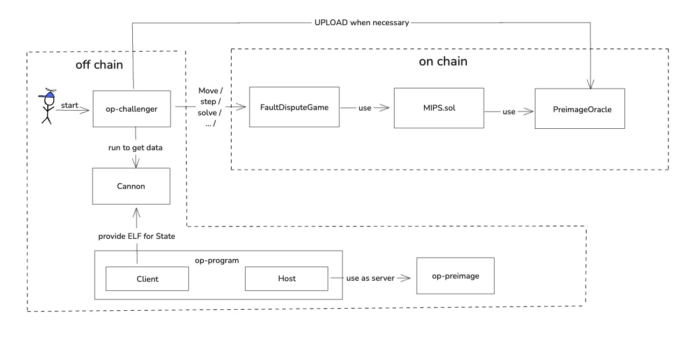

# op-challenger

op-challenger is primarily responsible for managing the FDG (Fault Dispute Game), utilizing components like Cannon and op-program to ensure the smooth operation of the entire FDG.



We divide op-challenger into two parts:

- Monitoring: Monitors the game processes and takes appropriate actions.
- Executing sub-tasks, such as step, move, upload preimage, etc.

## Monitoring
The monitor component subscribes to blocks on L1. Whenever a new block is generated, it retrieves all games to see if any specific actions need to be allocated and executed.

### Starting Monitoring
Use the [StartMonitoring()](https://github.com/ethereum-optimism/optimism/blob/develop/op-challenger/game/monitor.go#L152) function to initiate monitoring. The `onNewL1Head()` function is passed as a callback parameter to `resubscribeFunction()` and ultimately registered to `eth.WatchHeadChanges`.
It checks every 10 seconds, and upon retrieving a new block, the hash and number of the block are passed into `progressGames()` for processing.

```

func (m *gameMonitor) onNewL1Head(ctx context.Context, sig eth.L1BlockRef) {
	m.clock.SetTime(sig.Time)
	if err := m.progressGames(ctx, sig.Hash, sig.Number); err != nil {
		m.logger.Error("Failed to progress games", "err", err)
	}
	if err := m.preimages.Schedule(sig.Hash, sig.Number); err != nil {
		m.logger.Error("Failed to validate large preimages", "err", err)
	}
}

func (m *gameMonitor) resubscribeFunction() event.ResubscribeErrFunc {
	// The ctx is cancelled as soon as the subscription is returned,
	// but is only used to create the subscription, and does not affect the returned subscription.
	return func(ctx context.Context, err error) (event.Subscription, error) {
		if err != nil {
			m.logger.Warn("resubscribing after failed L1 subscription", "err", err)
		}
		return eth.WatchHeadChanges(ctx, m.l1Source, m.onNewL1Head)
	}
}

func (m *gameMonitor) StartMonitoring() {
	m.runState.Lock()
	defer m.runState.Unlock()
	if m.l1HeadsSub != nil {
		return // already started
	}
	m.l1HeadsSub = event.ResubscribeErr(time.Second*10, m.resubscribeFunction())
}
```

### Assigning Sub-Tasks

The [progressGames](https://github.com/ethereum-optimism/optimism/blob/f940301caf531996eee4172e710b0decb7b78dde/op-challenger/game/monitor.go#L106) function executes upon detecting a new block. Its primary role is to retrieve all valid games and pass these games into the Schedule for subsequent task dispatching. It is important to note that the schedule is divided into multiple categories, such as bondSchedule (for managing claims corresponding to bonds) and pre-image schedule (for uploading pre-image data). Here, we will only discuss the basic schedule for move and step tasks.

```
func (m *gameMonitor) progressGames(ctx context.Context, blockHash common.Hash, blockNumber uint64) error {
	minGameTimestamp := clock.MinCheckedTimestamp(m.clock, m.gameWindow)
	games, err := m.source.GetGamesAtOrAfter(ctx, blockHash, minGameTimestamp)
	if err != nil {
		return fmt.Errorf("failed to load games: %w", err)
	}
	var gamesToPlay []types.GameMetadata
	for _, game := range games {
		if !m.allowedGame(game.Proxy) {
			m.logger.Debug("Skipping game not on allow list", "game", game.Proxy)
			continue
		}
		gamesToPlay = append(gamesToPlay, game)
	}
	if err := m.claimer.Schedule(blockNumber, gamesToPlay); err != nil {
		return fmt.Errorf("failed to schedule bond claims: %w", err)
	}
	if err := m.scheduler.Schedule(gamesToPlay, blockNumber); errors.Is(err, scheduler.ErrBusy) {
		m.logger.Info("Scheduler still busy with previous update")
	} else if err != nil {
		return fmt.Errorf("failed to schedule games: %w", err)
	}
	return nil
}
```

The [schedule()](https://github.com/ethereum-optimism/optimism/blob/f940301caf531996eee4172e710b0decb7b78dde/op-challenger/game/scheduler/coordinator.go#L60) function processes the received games and determines in createJob whether new sub-operations are needed for each game. Then, it uses the enqueueJob function to add all sub-operations to the jobQueue for transmission.


```
func (c *coordinator) schedule(ctx context.Context, games []types.GameMetadata, blockNumber uint64) error {
    
        ……
        
	// Next collect all the jobs to schedule and ensure all games are recorded in the states map.
	// Otherwise, results may start being processed before all games are recorded, resulting in existing
	// data directories potentially being deleted for games that are required.
	for _, game := range games {
		if j, err := c.createJob(ctx, game, blockNumber); err != nil {
			errs = append(errs, fmt.Errorf("failed to create job for game %v: %w", game.Proxy, err))
		} else if j != nil {
			jobs = append(jobs, *j)
			c.m.RecordGameUpdateScheduled()
		}
	}
    
        ……
        
	// Finally, enqueue the jobs
	for _, j := range jobs {
		if err := c.enqueueJob(ctx, j); err != nil {
			errs = append(errs, fmt.Errorf("failed to enqueue job for game %v: %w", j.addr, err))
		}
	}
	return errors.Join(errs...)
}
```

## Execution of Sub-Tasks

### Generating Action
When data appears in the jobQueue, it is transformed into specific actions in the [CalculateNextActions()](https://github.com/ethereum-optimism/optimism/blob/f940301caf531996eee4172e710b0decb7b78dde/op-challenger/game/fault/solver/game_solver.go#L26). For example, with the step action, when the game depth reaches MaxDepth, we generate the corresponding step action.

```
func (s *GameSolver) CalculateNextActions(ctx context.Context, game types.Game) ([]types.Action, error) {

        ……
	var actions []types.Action
	agreedClaims := newHonestClaimTracker()

	for _, claim := range game.Claims() {
		var action *types.Action
		if claim.Depth() == game.MaxDepth() {
			action, err = s.calculateStep(ctx, game, claim, agreedClaims)
		} else {
			action, err = s.calculateMove(ctx, game, claim, agreedClaims)
		}
        ……
		if action == nil {
			continue
		}
		actions = append(actions, *action)
	}
	return actions, nil
}
```
```
func (s *GameSolver) calculateStep(ctx context.Context, game types.Game, claim types.Claim, agreedClaims *honestClaimTracker) (*types.Action, error) {
	if claim.CounteredBy != (common.Address{}) {
		return nil, nil
	}
	step, err := s.claimSolver.AttemptStep(ctx, game, claim, agreedClaims)
	if err != nil {
		return nil, err
	}
	if step == nil {
		return nil, nil
	}
	return &types.Action{
		Type:        types.ActionTypeStep,
		ParentClaim: step.LeafClaim,
		IsAttack:    step.IsAttack,
		PreState:    step.PreState,
		ProofData:   step.ProofData,
		OracleData:  step.OracleData,
	}, nil
}
```

```
func (s *claimSolver) AttemptStep(ctx context.Context, game types.Game, claim types.Claim, honestClaims *honestClaimTracker) (*StepData, error) {

        ……
	preState, proofData, oracleData, err := s.trace.GetStepData(ctx, game, claim, position)
	if err != nil {
		return nil, err
	}

	return &StepData{
		LeafClaim:  claim,
		IsAttack:   !claimCorrect,
		PreState:   preState,
		ProofData:  proofData,
		OracleData: oracleData,
	}, nil
}
```

The `GetStepData()` function indirectly calls the [DoGenerateProof()](https://github.com/ethereum-optimism/optimism/blob/develop/op-challenger/game/fault/trace/vm/executor.go#L74) function, which initiates Cannon to produce the necessary state data and proof data for the step.

```
func (e *Executor) DoGenerateProof(ctx context.Context, dir string, begin uint64, end uint64, extraVmArgs ...string) error {
        ……
	args := []string{
		"run",
		"--input", start,
		"--output", lastGeneratedState,
		"--meta", "",
		"--info-at", "%" + strconv.FormatUint(uint64(e.cfg.InfoFreq), 10),
		"--proof-at", "=" + strconv.FormatUint(end, 10),
		"--proof-fmt", filepath.Join(proofDir, "%d.json.gz"),
		"--snapshot-at", "%" + strconv.FormatUint(uint64(e.cfg.SnapshotFreq), 10),
		"--snapshot-fmt", filepath.Join(snapshotDir, "%d.json.gz"),
	}
	if end < math.MaxUint64 {
		args = append(args, "--stop-at", "="+strconv.FormatUint(end+1, 10))
	}
	if e.cfg.DebugInfo {
		args = append(args, "--debug-info", filepath.Join(dataDir, debugFilename))
	}
	args = append(args, extraVmArgs...)
	args = append(args,
		"--",
		e.cfg.Server, "--server",
		"--l1", e.cfg.L1,
		"--l1.beacon", e.cfg.L1Beacon,
		"--l2", e.cfg.L2,
		"--datadir", dataDir,
		"--l1.head", e.inputs.L1Head.Hex(),
		"--l2.head", e.inputs.L2Head.Hex(),
		"--l2.outputroot", e.inputs.L2OutputRoot.Hex(),
		"--l2.claim", e.inputs.L2Claim.Hex(),
		"--l2.blocknumber", e.inputs.L2BlockNumber.Text(10),
	)
        ……
	err = e.cmdExecutor(ctx, e.logger.New("proof", end), e.cfg.VmBin, args...)
        ……
	return err
}
```

### Executing Action
The obtained actions are executed in [PerformAction()](https://github.com/ethereum-optimism/optimism/blob/f940301caf531996eee4172e710b0decb7b78dde/op-challenger/game/fault/responder/responder.go#L90). This function judges and executes the corresponding on-chain operations based on the type of action:

- Determines whether Pre-image data needs to be uploaded.
- Assesses whether the operation type is Attack/Defend.
- Decides whether it is a Step operation.
- Evaluates whether the root claim can be denied from the perspective of L2BlockNumber.

```
func (r *FaultResponder) PerformAction(ctx context.Context, action types.Action) error {
	if action.OracleData != nil {
		var preimageExists bool
		var err error
		if !action.OracleData.IsLocal {
			preimageExists, err = r.oracle.GlobalDataExists(ctx, action.OracleData)
			if err != nil {
				return fmt.Errorf("failed to check if preimage exists: %w", err)
			}
		}
		// Always upload local preimages
		if !preimageExists {
			err := r.uploader.UploadPreimage(ctx, uint64(action.ParentClaim.ContractIndex), action.OracleData)
			if errors.Is(err, preimages.ErrChallengePeriodNotOver) {
				r.log.Debug("Large Preimage Squeeze failed, challenge period not over")
				return nil
			} else if err != nil {
				return fmt.Errorf("failed to upload preimage: %w", err)
			}
		}
	}
	var candidate txmgr.TxCandidate
	var err error
	switch action.Type {
	case types.ActionTypeMove:
		if action.IsAttack {
			candidate, err = r.contract.AttackTx(ctx, action.ParentClaim, action.Value)
		} else {
			candidate, err = r.contract.DefendTx(ctx, action.ParentClaim, action.Value)
		}
	case types.ActionTypeStep:
		candidate, err = r.contract.StepTx(uint64(action.ParentClaim.ContractIndex), action.IsAttack, action.PreState, action.ProofData)
	case types.ActionTypeChallengeL2BlockNumber:
		candidate, err = r.contract.ChallengeL2BlockNumberTx(action.InvalidL2BlockNumberChallenge)
	}
	if err != nil {
		return err
	}
	return r.sender.SendAndWaitSimple("perform action", candidate)
}
```

## Conclusion

op-challenger is a highly automated system designed for fault proofing, aimed at real-time monitoring and responding to changes in on-chain game states. By continuously listening to blockchain events and dynamically executing attack or defense actions based on game states, op-challenger offers a strategic, responsive solution. The system is tightly integrated with key components like cannon and op-program, enabling the automated generation of data inputs required for game steps and ensuring the accurate execution of game decisions.